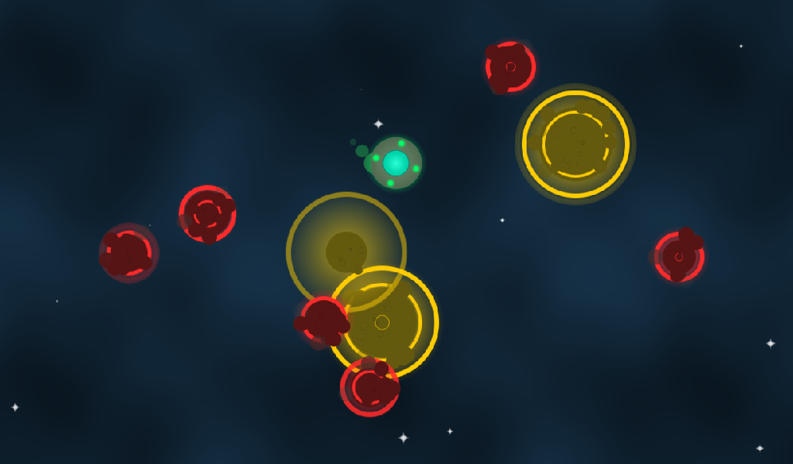

*Libre* (from French, meaning **free**); *rama* (part of *fliperama*, from
Portuguese, meaning **arcade**).

# Librerama: A free/libre fast-paced arcade collection of mini-games

## Overview

**Librerama** is an arcade compilation of very small, fast-paced mini-games
(nicknamed "nanogames"), with the main objective being to rack up the highest
score possible by winning the most nanogames you can before getting a game
over, while they progressively increase in both speed and difficulty.

While the game itself comes with its own collection of nanogames, custom ones
can also be made and played.

**This game is a work-in-progress!** Which means that a lot of things are
missing, and what is present can change at any moment.

## Editing and Exporting

The game is made using the
**[Godot Engine](https://godotengine.org/download)**, and it's the only tool
needed to both edit the project and to export binaries to be played across
multiple platforms. Suffice to say, knowledge in how to use it is necessary.

The *minimum* engine version expected is **4.3.0**, but it's *recommended* to
use the latest **4.3.\*** version if possible.

## Documentation

Information on how to make your own custom nanogames (including some general
design tips) can be found in the repository's internal
[wiki](https://codeberg.org/Librerama/librerama/wiki/_pages).

## Community

An official Matrix chat room can be found and entered using this
[invitation link](https://matrix.to/#/#librerama:matrix.org), where general
discussion about the game and nanogame-making can happen.

## Donations

Librerama is not just free as in *freedom*, but also free as in
*free of charge*, so monetary contributions are very much welcomed!

Donations can be made to me via
**[Liberapay](https://liberapay.com/Yeldham/donate)**. The money will be used
to help me put more work not just into this game, but also my general work in
free/libre gaming.

## Screenshots

## Licenses

### Source code

This program is
[free software](https://www.gnu.org/philosophy/free-sw.html): you can
redistribute it and/or modify it under the terms of the
[GNU General Public License](https://www.gnu.org/licenses/gpl-3.0.html) as
published by the Free Software Foundation, either version 3 of the License, or
(at your option) any later version.

### Assets

All assets (those being files of images or sounds) are under the
[CC BY-SA 4.0](https://creativecommons.org/licenses/by-sa/4.0/) license, unless
otherwise specified.

### Third-party

Librerama is developed using the **[Godot Engine](https://godotengine.org)**,
under the [MIT](https://opensource.org/licenses/MIT) license.

Godot Engine, and therefore Librerama itself makes use of
**[FreeType](https://freetype.org)** for font rendering, under the
[FTL](https://git.savannah.gnu.org/cgit/freetype/freetype2.git/tree/docs/FTL.TXT)
license.

Librerama also uses Google's **Noto** family of fonts, all under the
[OFL-1.1](https://opensource.org/licenses/OFL-1.1) license.

For the licenses of the third-party components used by the nanogames themselves
(all under [free culture](https://freedomdefined.org/Definition) licenses),
check their individual "nanogame.json" files.
