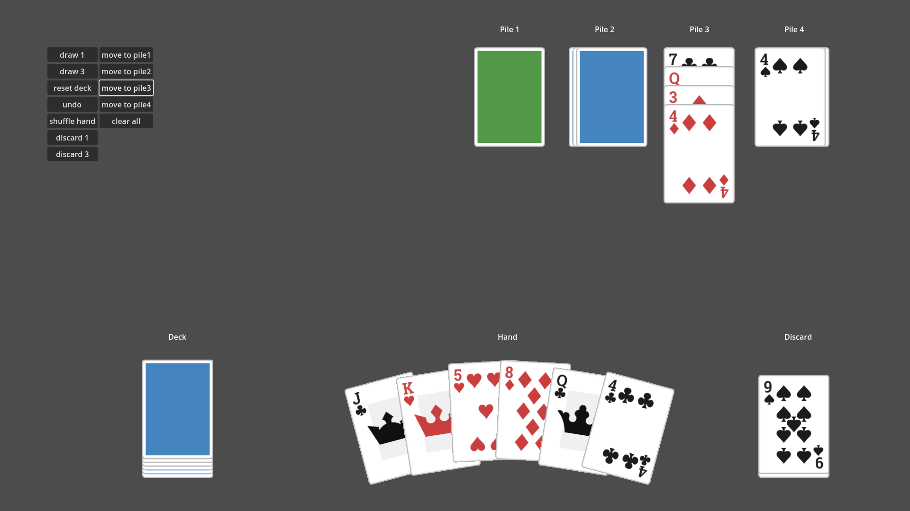
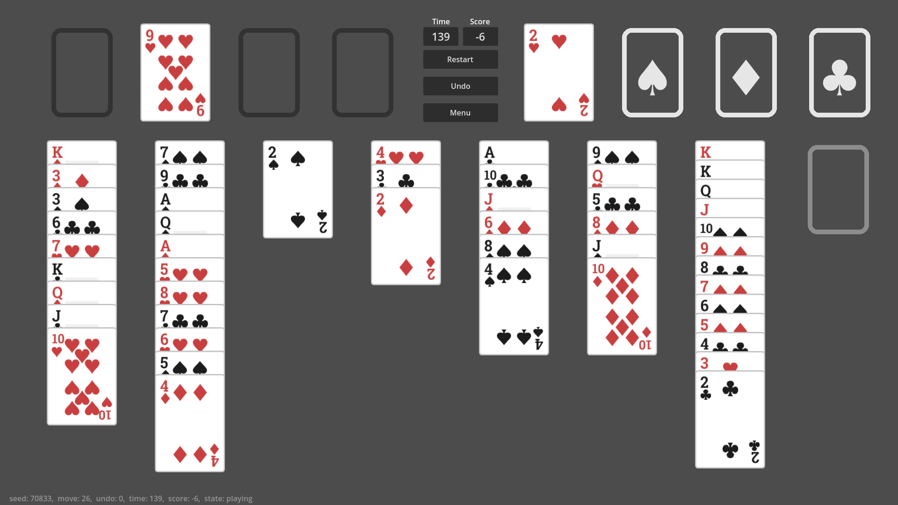

# Card Framework

**Card Framework** is a lightweight, extensible toolkit for **creating 2D card games** in the **Godot Engine**. Whether you're building a **classic Solitaire**, a **TCG (Trading Card Game)**, or a **deck-building roguelike**, the Card Framework provides flexible card handling and UI structures to speed up development. Use this framework as a **starting point** for card-based gameplay in any 2D project.





## Table of Contents
- [Card Framework](#card-framework)
  - [Table of Contents](#table-of-contents)
  - [Features](#features)
  - [Installation](#installation)
  - [Getting Started](#getting-started)
  - [Classes](#classes)
    - [CardManager](#cardmanager)
      - [Properties](#properties)
      - [Methods](#methods)
    - [Card](#card)
      - [Properties](#properties-1)
      - [Methods](#methods-1)
    - [CardFactory](#cardfactory)
      - [Properties](#properties-2)
      - [Methods](#methods-2)
    - [CardContainer](#cardcontainer)
      - [Properties](#properties-3)
      - [Methods](#methods-3)
    - [Pile](#pile)
      - [Properties](#properties-4)
      - [Methods](#methods-4)
    - [Hand](#hand)
      - [Properties](#properties-5)
      - [Methods](#methods-5)
  - [Creating Card Info JSON Files](#creating-card-info-json-files)
    - [Example](#example)
  - [Sample Projects](#sample-projects)
    - [Example1](#example1)
    - [Freecell](#freecell)
  - [Contributing](#contributing)
  - [License / Credits](#license--credits)
    - [Kenney.nl Card Assets](#kenneynl-card-assets)
    - [ChatGPT-Generated Spot Images](#chatgpt-generated-spot-images)
  - [Thanks To](#thanks-to)
  - [Changelog](#changelog)
    - [1.0.0 (2025-01-03)](#100-2025-01-03)


## Features
* **Card Creation & Management**: Easily define and instantiate cards with custom attributes or visuals.
* **Drag-and-Drop Interactions**: Built-in 2D control nodes to handle common card movements.
* **Card Container**: Create and manage various modules like Piles or Hands, enabling flexible card organization in different game scenarios.
* **Scalable Architecture**: Extend or modify the base classes to suit various genres (Solitaire, TCG, etc.).
* **Lightweight & Modular**: Include only the parts you need, so it won't bloat your project.


## Installation
1. **Download from Godot Editor’s AssetLib**
   * Open Godot and navigate to the **AssetLib** tab.
   * Search for **CardFramework** and download the latest version.
2. **Manual Download to** `addons/card-framework`
   * Alternatively, download the latest version directly.
   * Copy or move the contents to your project under `res://addons/card-framework`.
3. **Check Usage Examples**
   * The folders `example1` and `freecell` demonstrate usage in real scenarios.
   * If you don’t need them, you can remove those folders from your project.


## Getting Started
1. **Instantiate the Card Manager**
   * In any scene that needs card functionality, **instantiate** the scene at `card-framework/card_manager.tscn`.
2. **Organize Card Images**
   * Save the images for your card fronts (and other card-related art) inside the designated `card_asset_dir` folder.
3. **Prepare Card Metadata**
   * Create JSON files that describe each card’s metadata (e.g., name, rank, suit, custom properties), and place them into the `card_info_dir` folder. [See example](#creating-card-info-json-files)
4. **Set Up the CardManager**
   * In the **Inspector** for your `CardManager` node, configure:
     * `card_size`: The default width/height for each card.
     * `card_asset_dir`: The folder containing your card images.
     * `card_info_dir`: The folder containing your JSON metadata.
     * `back_image`: The texture to use for the card’s backside.
5. **Assign a CardFactory**
   * Under the `CardManager`, choose the `CardFactory` class to use.
   * You can use the default `CardFactory` or **create a custom factory** (by extending `CardFactory`) and set it here.
6. **Add Card Containers**
   * Within `CardManager`, instantiate and arrange `Pile`, `Hand`, or any custom `CardContainer` nodes you’ve created.
   * Use these containers to organize the deck, discard piles, player hands, or any other card layout required by your game.


## Classes

### CardManager
The **Root Node** for the Card Framework.
* Oversees all card-related nodes, manages card factories, and coordinates card creation, movement, and container relationships.

#### Properties
| Type         | Name               | Default       | Description                                                 |
| ------------ | ------------------ | ------------- | ----------------------------------------------------------- |
| **Vector2**  | `card_size`       | (150, 210)    | The default size (width × height) for each card.            |
| **String**   | `card_asset_dir`  | *null*     | Directory containing the card image assets. **(Required)**                 |
| **String**   | `card_info_dir`   | *null*     | Directory containing JSON files for card information. **(Required)**      |
| **Texture2D**| `back_image`      | *null*      | The texture used for the backside of all cards. **(Required)**            |
| **PackedScene** | `card_factory_scene` | *null*  | The scene responsible for spawning new card objects. **(Required)**       |

#### Methods
| Method Signature        | Description                                        |
| ----------------------- | -------------------------------------------------- |
| **func undo() -> void** | Reverts the last recorded move in the history.    |
| **func reset_history() -> void** | Clears all move records from the history.       |

[⬆ Back to Top](#cardmanager)

---

### Card
A **Node** representing a single playing card.
* Stores information about name, card image, or custom data.

#### Properties
| Type          | Name                   | Default       | Description                                                                                         |
| ------------- | ---------------------- | ------------- | --------------------------------------------------------------------------------------------------- |
| **String**    | `card_name`           | *null*     | The name of the card.                                                                               |
| **Vector2**   | `card_size`           | (150, 210)    | The width/height of the card.                                                                       |
| **Texture2D** | `front_image`         | *null*      | The texture used for the card’s front face.                                                         |
| **Texture2D** | `back_image`          | *null*      | The texture used for the card’s back face.                                                          |
| **bool**      | `show_front`          | true          | Determines whether the front face is shown (`true`) or the back face (`false`).                     |
| **int**       | `moving_speed`        | 2000          | The speed at which the card moves during animations or transitions.                                 |
| **bool**      | `can_be_interacted_with` | true       | Whether the card can be interacted with (e.g., clicked, dragged).                                   |
| **int**       | `hover_distance`      | 10            | How many pixels the card **hovers** above its position when interacted with (e.g., picking up a card).|

#### Methods
| Method Signature                                                           | Description                                                                                                                   |
| ------------------------------------------------------------------------- | ----------------------------------------------------------------------------------------------------------------------------- |
| **func set_faces(front_face: Texture2D, back_face: Texture2D) -> void**  | Sets the card’s front and back textures (`front_face_texture` and `back_face_texture`).                                       |
| **func return_card() -> void**                                            | Return card to stored `destination`.               |
| **func move(target_destination: Vector2, degree: float) -> void**         | Moves the card to `target_destination` at a given rotation angle (`degree`).          |
| **func start_hovering() -> void**                                         | Initiates a **hover** effect (raising the card visually). |
| **func end_hovering(restore_card_position: bool) -> void**                | Ends the **hover** effect. |
| **func set_holding() -> void**                                            | Marks the card as **holding**. |
| **func set_releasing() -> void**                                          | Unmarks the card as **holding**.                                                                           |
| **func get_string() -> String**                                           | Returns `card_name` as a string representation of the card.                                                                   |

[⬆ Back to Top](#card)

---


### CardFactory
A **Class** responsible for creating cards.
* Instanced by the `CardManager` to spawn `Card` nodes.

#### Properties
| Type         | Name                | Default | Description                            |
| ------------ | ------------------- | ------- | -------------------------------------- |
| **PackedScene** | `default_card_scene` | *null* | A base card scene to instantiate. **(Required)**      |

#### Methods
| Method Signature                                              | Description                                                                                                                 |
| ------------------------------------------------------------- | --------------------------------------------------------------------------------------------------------------------------- |
| **func create_card(card_name: String, target: CardContainer) -> Card** | Creates a new `Card` under the specified `CardContainer`. <br/> <ul><li>Requires a matching JSON file in `card_info_dir`.</li><li>`card_name` must match the JSON filename.</li></ul> |
| **func preload_card_data() -> void**                         | Preloads all card data in `card_info_dir`. <br/> Any card not preloaded here will be loaded on-demand when `create_card()` is called. |

[⬆ Back to Top](#cardfactory)

---


### CardContainer
A **Node** that holds one or more `Card` nodes.
* Placed as a child of `CardManager`.
* Manages how cards are organized, displayed, and interacted with (e.g., piles, hands).

#### Properties

| Type      | Name              | Default | Description                                                                        |
| --------- | ----------------- | ------- | ---------------------------------------------------------------------------------- |
| **bool**      | `enable_drop_zone`  | true    | Enables or disables the drop zone functionality.                                  |
| **Vector2**   | `sensor_size`       | *null*  | The size of the sensor. If not set, it follows the size of the card.              |
| **Vector2**   | `sensor_position`   | *null*  | The position of the sensor.                                                       |
| **Texture**   | `sensor_texture`    | *null*  | The texture used for the sensor.                                                  |
| **bool**      | `sensor_visibility` | true    | Determines whether the sensor is visible or not.                                  |

#### Methods
Below is a reference for **CardContainer** methods you may **override** when implementing a custom card container. Override these in your subclass to tailor card behavior to your specific game mechanics:

| Method Signature                                      | Description                                                                                                        |
| ------------------------------------------------------- | ------------------------------------------------------------------------------------------------------------------ |
| **func add_card(card: Card) -> void**                  | Adds a `card` to the container.                                                                                    |
| **func remove_card(card: Card) -> bool**               | Removes `card` from the container. Returns `true` if successful, `false` if the card was not found.                |
| **func has_card(card: Card) -> bool**                  | Checks if the container currently holds the given `card`.                                                          |
| **func clear_cards() -> void**                         | Removes all cards from the container.                                                                              |
| **func check_card_can_be_dropped(cards: Array) -> bool** | Determines if `cards` can be dropped onto this container (e.g., rules validation). Returns `true` if allowed.       |
| **func shuffle() -> void**                             | Shuffles the order of cards in the container.                                                                      |
| **func move_cards(cards: Array, with_history: bool = true) -> bool** | Moves the specified `cards` into this container, optionally recording the move in history if `with_history` is `true`. It returns `true` if move successes |
| **func undo(cards: Array) -> void**                    | Reverses a recorded move (undo) for the specified `cards`.                                                         |
| **func hold_card(card: Card) -> void**                 | Holds the given `card` in this container (e.g., marking it as temporarily selected or locked).                      |
| **func release_holding_cards() -> void**               | Releases all currently held cards in this container, returning them to normal state.                                |
| **func get_string() -> String**                        | Returns a string representation of the container’s state or contents.                                              |
| **func on_card_move_done(_card: Card) -> void**        | Called after a card has finished moving **into** this container.                                                   |
| **func on_card_pressed(_card: Card) -> void**          | Called when a card in this container is clicked.                                                                   |

[⬆ Back to Top](#cardcontainer)

---


### Pile
A **CardContainer** implementation for a **stack of cards**.
* Useful for decks, discard piles, or any form of stacked card structure.

#### Properties
| Type        | Name                            | Default           | Description                                                                                                  |
| ----------- | ------------------------------- | ----------------- | ------------------------------------------------------------------------------------------------------------ |
| **float**   | `stack_display_gap`             | 8                 | The distance (in pixels) between each card in the pile.                                                      |
| **int**     | `max_stack_display`             | 6                 | The maximum number of cards to visually display at once; extra cards may be hidden or overlapped.            |
| **bool**    | `card_face_up`                  | true              | Whether cards in the pile are shown face-up (`true`) or face-down (`false`).                                 |
| **PileDirection** | `layout`                  | `PileDirection.UP`| The direction in which cards are stacked: `UP`, `DOWN`, `LEFT`, or `RIGHT`.                                  |
| **bool**    | `allow_card_movement`           | true              | Enables or disables card movement in this pile.                                                              |
| **bool**    | `restrict_to_top_card`          | true              | If `true`, only the top card can be moved (Requires `allow_card_movement` to be `true`).                      |
| **bool**    | `align_drop_zone_with_top_card` | true              | If `true`, the pile’s drop zone follows the position of the top card (Requires `allow_card_movement` to be `true`). |

#### Methods
| Method Signature                     | Description                                                                      |
| ------------------------------------ | -------------------------------------------------------------------------------- |
| **func get_top_cards(n: int) -> Array** | Returns an array of up to `n` cards from the top of the pile. |

[⬆ Back to Top](#pile)

---


### Hand
A **CardContainer** implementation for a **player’s hand** of cards.
* A **Curve** resource can be used to control how cards are distributed along an arc. This allows you to create a more natural “fanned” or curved hand appearance rather than a flat line.

#### Properties
| Type      | Name                 | Default | Description                                                                                                                |
| --------- | -------------------- | ------- | -------------------------------------------------------------------------------------------------------------------------- |
| Vector2   | `hand_area`         | *(0,0)* | The area in which cards can be laid out for this hand.                                                                     |
| int       | `max_hand_size`     | 10      | The maximum number of cards this hand can hold.                                                                            |
| float     | `max_hand_spread`   | 700     | The maximum horizontal spread (in pixels) used when laying out cards in the hand.                                          |
| bool      | `card_face_up`      | true    | Whether the hand displays cards face up (`true`) or face down (`false`).                                                  |
| int       | `card_hover_distance` | 30     | The distance (in pixels) that a card **hovers** above the hand when interacted with.                                         |
| Curve     | `hand_rotation_curve` | *null* | Used to adjust the **rotation** of each card in the hand; works best as a 2-point linear curve (left to right). **(Required)**            |
| Curve     | `hand_vertical_curve` | *null* | Used to adjust the **vertical positioning** of each card in the hand; works best as a 3-point ease in/out curve (0→X→0). **(Required)**     |

#### Methods
| Method Signature                      | Description                                                                                  |
| ------------------------------------ | -------------------------------------------------------------------------------------------- |
| **func get_random_cards(n: int) -> Array** | Returns an array of up to `n` randomly chosen cards from the hand.                          |

[⬆ Back to Top](#hand)

---


## Creating Card Info JSON Files

1. **Create a JSON file** 
   In the `card_info_dir` directory, create a JSON file named after your card, e.g., `card_name.json`.

2. **Required Fields**  
   - `name`: The card’s identifier in the game.
   - `front_image`: The filename (relative to `card_asset_dir`) of the texture used for the card’s front face.

3. **Additional Fields**  
   - You can add any custom properties (e.g., `suit`, `value`, or other game-specific data).
   - To utilize these properties, consider **extending the `Card` class** and handling the extra data accordingly. Refer to the `PlayingCard` node example in the `freecell/card` directory.

### Example

**Filename:** `club_2.json`

```json
{
    "name": "club_2",
    "front_image": "cardClubs2.png",
    "suit": "club",
    "value": "2"
}
```

## Sample Projects


### Example1


A **simple demonstration** of the Card Framework.  
- Uses **Pile** and **Hand** nodes to create basic deck, hand, and discard piles.  
- Each pile showcases different properties, allowing you to explore how these settings affect card behavior.

---


### Freecell


A **full FreeCell Game** built on top of the Card Framework.
- **`PlayingCard`**: An extended `Card` class for standard playing cards.  
- **`Foundation`, `Tableau`, and `Freecell`**: Custom `CardContainer` subclasses implementing FreeCell’s unique rules.  
  - Notably, **`Tableau`** supports moving multiple cards at once.  
- Main implementation is found under **`scenes/main_game/freecell_game`**.  
- Also includes **seed-based game generation**, **statistics**, and additional details for a production-ready solitaire-like game.

## Contributing

Contributions are welcome! Please follow these steps to contribute:

1. Fork the repository.
2. Create a new branch for your feature or bugfix.
3. Commit your changes with clear and descriptive messages.
4. Open a pull request detailing your changes and the problem they solve.

Please ensure your code adheres to the existing style and includes relevant documentation.

## License / Credits

### Kenney.nl Card Assets

- **Path**: `res://freecell/assets/images/cards/`, `res://example1/assets/images/cards/`
- **Source**: [Kenney - Boardgame Pack](https://www.kenney.nl/assets/boardgame-pack)
- **License**: [CC0 (Creative Commons Zero)](https://creativecommons.org/publicdomain/zero/1.0/)

---

### ChatGPT-Generated Spot Images

- **Path**: `res://freecell/assets/images/spots/`
- **Description**: These spot images were generated with assistance from ChatGPT.
- **Usage**: They can be used freely within this project.


## Thanks To
- [Kenney.nl](https://www.kenney.nl)
- [InsideOut-Andrew's Simple Card Pile UI](https://github.com/insideout-andrew/simple-card-pile-ui)
- [Rosetta Code - Deal cards for FreeCell](https://rosettacode.org/wiki/Deal_cards_for_FreeCell)


## Changelog

### 1.0.0 (2025-01-03)

* initial release